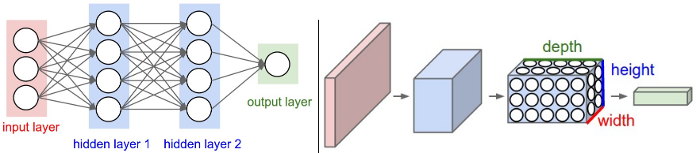

```{r setup, include=FALSE}
knitr::opts_chunk$set(echo = TRUE, eval = FALSE)
```

## Tensorflow in Combination With R

Tensorflow (TF) is an open source library for machine learning, originally developed by Google. It became extremely popular recently, with about 42,500 stars and 20,000 forks on Github.

The main principle behind TF are so called _computational data flow graphs_. A machine learning model (like e.g. a neural network) is described in its enirety through such a graph. All nodes in that graph are placeholder objects. Only after the whole graph has been initialized, actual data is fed into the nodes. This makes it easier to quickly change the structure of the model, without having to worry about keeping the model with all weights etc. in memory.

Initially, Google provided an API for Python and C++, but the team behind RStudio recently released a [package](https://github.com/rstudio/tensorflow), that provides a TF Interface for R. Although the project is still in a quite early stage, we decided to work with this package in order to get a flexible library for deep learning projects - which are surprisingly rare in R. We were eager to be part of the very early adopters of the R/Tensorflow combination, so that  we even submitted some [error fixes](https://github.com/rstudio/tensorflow/issues/37) on Github in order to get the package to work on our system.

## Deep Neural Nets for Facial Keypoints Detection

Since we want to predict 15 keypoints in the face of a person, each having an x- and a y-coordinate, the prediciton of the statistical model has to provide 30 values. Moreover, the facial keypoints detection problem is a regression problem: the predicted number for a certain keypoint position contains spatial information, which would be lost if the prediction would be treated as a classification problem (i.e. no numerical order of the values). As the analyzed data set's images have the dimensions [96, 96], the predicted values should also lie in that range.

The nature of multi-node layers in neural networks makes it easy to obtain multiple outputs (as compared to other model-types where it might be necessary to create one model for every prediction value). In addition, especially convolutional neural networks have proven to work very well in image related problems (and more generally in problems where spatial information matters). We have built and successfully trained a multi-layer perceptron and a convolutional neural network, which will be described in the following.

## Multi-Layer Perceptron (MLP)
### Data Preparation
After loading the tensorflow package
```{r}
library(tensorflow)
```
the data has to be prepared in order for TF to process it.
First, the data has to be in the matrix data format.
```{r}
train.x = as.matrix(d.train$Image)
train.y = as.matrix(d.train[,-31])
```
TF expects input to be scaled to values in the interval [0, 1], so we scale the pixel intensities (i.e. feature values) by dividing by 255 (where 0 is a black pixel and 255 is a white pixel).
```{r}
train.x = train.x / 255
```
On the middle of the image, we place the origin of the coordinate system, such that the left (/down) most point is -1 and the right (/up) most point is +1. Each of the target values is scaled into this [-1, 1] interval (from prior [0, 96]).
```{r}
train.y = (train.y - 48) / 48
```

### Hyperparameters
We control four different hyperparameters, that can be adapted once we decided for a certain network structure:

* Learning Rate. Controls how big of a step the optimization algorithm should take in every training step. High values mean potentially faster results from training, but might miss out on optima, by "overstepping" them.
* Number of training epochs. One epoch marks one run-through of all training data through the training process.
* Batch size. From the training data, a random batch is drawn on every training step. Only this data is then used to further train the network. After one training epoch, all batches in the training set have been used.
* Display Step. How often we want to log the current status.

```{r}
learning_rate = 0.001
training_epochs = 1000L
batch_size = 50L
display_step = 1L
```

### Network Structure
We experimented with different depths of the network but realized quickly that training on a CPU (as opposed to a GPU) puts certain limits on the complexity. Nevertheless, we achieved decent results with the following structure (in combination with the above hyperparameters).

```{r}
n_input = 9216L # 96x96 pixels
n_hidden_1 = 256L # 1st layer number of features
n_hidden_2 = 256L # 2nd layer number of features
n_classes = 30L # 15 x, 15 y coordinates
```

### Tensorflow Graph
First we create some placeholder variables to hold the input (x) and the output (y).
```{r}
x = tf$placeholder(tf$float32, shape(NULL, n_input))
y = tf$placeholder(tf$float32, shape(NULL, n_classes))
```
Then we create two convenience functions to simplify the creation of weight and bias variables. These variables get initialized with a random number, whose extent can be modified via the _stddev_ parameter.
```{r}
weight_variable <- function(shape) {
  initial <- tf$truncated_normal(shape, stddev=0.1)
  tf$Variable(initial)
}

bias_variable <- function(shape) {
  initial <- tf$constant(0.1, shape=shape)
  tf$Variable(initial)
}
```
Afterwards we define the actual model in the graph. (Hidden) Layer 1 is a matrix multiplication of the input x. The shape is defined by the parameters specified in the **Network Structure** section. The output of this layer runs through the _ReLU_ (_Rectified Linear Unit_) activation function $f(x)=max(0, x)$, which sets all negative output to 0. The output is fed into the second (hidden) layer, which performs another matrix multiplication and has the previosuly defined shape. The activation function is again a ReLU. Finally, the output is fed into the output layer, which has exactly 30 nodes to represent all 15 coordinate pairs of the facial keypoints.
```{r}
layer1 = tf$add(tf$matmul(x, weight_variable(shape(n_input, n_hidden_1))),
                bias_variable(shape(n_hidden_1)))
layer1 = tf$nn$relu(layer1)

layer2 = tf$add(tf$matmul(layer1, weight_variable(shape(n_hidden_1, n_hidden_2))),
                bias_variable(shape(n_hidden_2)))
layer2 = tf$nn$relu(layer2)

out_layer = tf$matmul(layer2, weight_variable(shape(n_hidden_2, n_classes))) +
            bias_variable(shape(n_classes))
```
Now we define the cost function of the optimization method, which is the MSE. For the optimization method itself we used the popular Adam Optimizer, which usually [converges faster](https://arxiv.org/pdf/1412.6980v8.pdf) than many other optimizers such as stochastic gradient decent. The accuracy measure used in the Kaggle competition is the RMSE. Therefore we can get an estimate of our performance on test data by taking the square root of the MSE. We multiply by 48 in order to account for the previous scaling of the training target data.
```{r}
cost = tf$reduce_mean(tf$square(out_layer - y))
optimizer = tf$train$AdamOptimizer(learning_rate = learning_rate)$minimize(cost)
accuracy = tf$sqrt(cost) * 48
```
Finally, this graph definition can not be interfaced until a TF session is launched and the TF variables we just created are initialized.
```{r}
sess <- tf$Session()
sess$run(tf$initialize_all_variables())
```
### Training and Evaluating the Model
First we define a function that makes it easy to pass batches into the training mechanism.
```{r}
nextBatchIndices <- function(indices, batchNr, batch_size) {
  position = batchNr * batch_size - batch_size + 1
  if ((position + batch_size) > length(indices)) {
    return(indices[position:length(indices)])
  }
  return(indices[position:(position + batch_size - 1)])
}
```
The number of batches for the training set is indirectly given by the hyperparameter _batch_size_.
```{r}
numberOfBatches = ceiling(nrow(train.x) / batch_size)
```
The training process takes place in two nested loops. The outer loop simply cycles for the specified number of training epochs, every time shuffling the indices of the training set in order to provide "fresh" batches for training, which helps regularizing (reduce overfitting) the network. In the inner loop the previosuly defined function is used to get the next batch of data, which is then used for training. In addition the current status of the progress is printed to the terminal.
```{r}
for(epoch in seq_len(training_epochs)) {
  shuffledIndices = sample(seq_len(nrow(train.x)))

  for(batchNr in seq_len(numberOfBatches)) {
    rowIndices = nextBatchIndices(shuffledIndices, batchNr, batch_size)

    train_accuracy <- sess$run(accuracy, feed_dict = dict(x = train.x[rowIndices, ], y = train.y[rowIndices, ]))
    cat(sprintf("Epoch: %d | Batch: %d/%d | Training RMSE: %g\n", epoch, batchNr, numberOfBatches, train_accuracy))

    sess$run(optimizer, feed_dict = dict(x = train.x[rowIndices, ], y = train.y[rowIndices, ]))
  }
}
```
After training is completed, one could assess the estimated performance on test data. This is not really necessary, as Kaggle provides us with a concrete accuracy score. However, using suffienctly large batch sizes can yield reasonable performance estimations just using the current batch already during training (like we do in the code above). Due to the shuffling + use of multiple epochs (emulates _replacement_) this is very similar to the bootstrap approach. For quick evaluations, one could also just split the training set into _train_ and _test_ and then feed the test data into the TF model.
```{r}
test_accuracy <- sess$run(accuracy, feed_dict = dict(x = test.x, y = test.y))
cat(sprintf("Test RMSE: %g", test_accuracy))
```
This test data can then be used to actually plot the output of the neural net on one of the corresponding images. The multiplications serve the purpose of rescaling.
```{r}
data = test.x * 255
pred = sess$run(out_layer, feed_dict = dict(x = test.x)) * 48 + 48
fkdR::plotFacialKeypoints(data, 1, pred)
```

### Submission File
Using the fkdR package, creating a submission file for the Kaggle competition only takes three simple steps. First, the test data set has to be scaled in order to be processed by our TF model. Second, the model has to predict the target value by feeding it the test data and scaling it back to the original scale. Third, the _writeSubmissionFile_ function has to be called.
```{r}
data = d.test$Image / 255
pred = sess$run(out_layer, feed_dict = dict(x = data)) * 48 + 48
fkdR::writeSubmissionFile(predictions = pred, "/path/for/submissions/")
```

### Save and Restore
Finally, we made an effort to save and restore the TF model (including the trained weights and biases), so that there is no data loss after restarting the R session.
```{r}
# Save data
saver <- tf$train$Saver()
data_file <- saver$save(sess, paste0("/path/for/submissions/", "fkdr_mlp_1000epochs.ckpt"))

# Restore Data
sess = tf$Session()
restorer = tf$train$import_meta_graph(paste0("/path/for/submissions/", "fkdr_mlp_1000epochs.ckpt.meta"))
restorer$restore(sess, tf$train$latest_checkpoint("/path/for/submissions/"))
```
Unfortunately, this (as of now) leads to unexpected behavior, although the code should be correct. We filed a Github issue for this and are in a conversation with two of the lead RStudio/Tensorflow programmers.

## Convolutional Neural Network (CNN)
In order to build a convolutional neural network, we need two more convenience functions and of course a different layer structure.

### Convolution, Max Pooling, Dropout and Fully Connected Layer
In the following, the process of convolution and pooling will be described in general, followed by the code that implements the theoretical excursion.

#### Theory
##### Convolution
A convolutional layer is essentially a set of so called filters, which can be trained. In contrast to traditional image recognition techniques, where filters like the _Sobel Edge Detector_ might be used to detect certain features in an image, the filters in the convolutional layer are randomly initialized (not predefined) and they are solely shaped through training the network.

A filter is essentially a window (typically 5 by 5 pixels) that slides (--> **convolves**) across an image. For colored images, the window is a cube (5x5x**3**), since the image contains three color channels.

Once a network is trained sufficiently, one of the filters might actually look like an edge (similar to Sobel for instance). The following picture shows an exemplary set of learned filters that can detect edges and other important features in images.


When using the trained network to make a prediction, the filter window slides across the image. Every pixel in the filter window gets matched with the underlying part of the image. If the pixels are similar, this contributes to a high activation of the filter. For the edge filter, this means that there is an edge in the image that looks similar to the edge that the filter represents.

It is common to pad the image with zeros around the edges in order for the convolution operation not to alter the spatial dimensions of the input.

##### Max Pooling
Max Pooling is a way to reduce the size of the feature map. Again, we slide a window (typically 2x2 pixels) across the image/activation map and produce a new, smaller map (when using 2x2 pixels: one quarter of the size). This is done by simply taking the highest value inside the sliding window as the only pixel for the new map. This causes the most prominent features of the map to persist, while less relevant information goes away. This has two benefits: it reduces computational cost, as less parameters have to be trained for the individual image maps and it helps to reduce overfitting, as the information gets more abstract.

##### Dropout
Dropout is another regularization technique, that works very well for [various reasons](http://neuralnetworksanddeeplearning.com/chap3.html). Essentially, it forces the neural net to learn multiple independent representations of the same data by alternately randomly disabling neurons in the learning phase.

##### Fully Connected Layer
The last (several) layer(s) of a convolutional net is a fully connected layer. Already known from the Multi-Layer Perceptron, it connects all nodes (30 in the current case) with all nodes from the previous layer.

The following image compares an abstract representation of a MLP vs. a CNN. The right side shows how the pooling operation reshapes the volume of activation maps, as the images get smaller and smaller. A fully connected layer as seen on the left side is also added in a CNN as the very last step.


#### Practice
##### Convenience Functions
In addition to the _weight_variable_ and _bias_variable_ functions, we create functions to handle convolution and max pooling. The stride (how many pixels does the window move per step) is set to 1 for convolution, and we use 2x2 max pooling.
```{r}
conv2d <- function(x, W) {
  tf$nn$conv2d(x, W, strides=c(1L, 1L, 1L, 1L), padding='SAME')
}

max_pool_2x2 <- function(x) {
  tf$nn$max_pool(
    x,
    ksize=c(1L, 2L, 2L, 1L),
    strides=c(1L, 2L, 2L, 1L),
    padding='SAME')
}
```

##### Tensorflow Graph Definition
We stack several of the layer types described in the **Theory** section on top of each other in an alternating format.

1) Convolutional layer with 32 filters and a 5x5 window size.
  + Image data needs to have four-dimensional shape for internal reasons.
  + Activation function is ReLU.
2) Max Pooling with 2x2 window.
3) Convolutional layer with 64 filters and a 5x5 window size.
4) Max Pooling with 2x2 window.
5) Fully connected layer with 1024 neurons to process on the entire image.
  + (Apply the dropout technique for regularization).
6) Fully connected layer with 30 output neurons.

```{r}
## First layer (convolution)
W_conv1 <- weight_variable(shape(5L, 5L, 1L, 32L))
b_conv1 <- bias_variable(shape(32L))
x_image <- tf$reshape(x, shape(-1L, 96L, 96L, 1L))
h_conv1 <- tf$nn$relu(conv2d(x_image, W_conv1) + b_conv1)
## Second layer (pooling)
h_pool1 <- max_pool_2x2(h_conv1)
## Third layer (convolution)
W_conv2 <- weight_variable(shape = shape(5L, 5L, 32L, 64L))
b_conv2 <- bias_variable(shape = shape(64L))
h_conv2 <- tf$nn$relu(conv2d(h_pool1, W_conv2) + b_conv2)
## Fourth layer (pooling)
h_pool2 <- max_pool_2x2(h_conv2)
## Fifth layer (fully connected)
W_fc1 <- weight_variable(shape(36864L, 1024L))
b_fc1 <- bias_variable(shape(1024L))
h_pool2_flat <- tf$reshape(h_pool2, shape(-1L, 24L * 24L * 64L))
h_fc1 <- tf$nn$relu(tf$matmul(h_pool2_flat, W_fc1) + b_fc1)
## Dropout
keep_prob <- tf$placeholder(tf$float32)
h_fc1_drop <- tf$nn$dropout(h_fc1, keep_prob)
## Sixth layer (readout, fully connected)
W_fc2 <- weight_variable(shape(1024L, 30L))
b_fc2 <- bias_variable(shape(30L))
y_conv <- tf$matmul(h_fc1_drop, W_fc2) + b_fc2
```

Training and evaluating the network follows the same principle as our MLP implementation.
